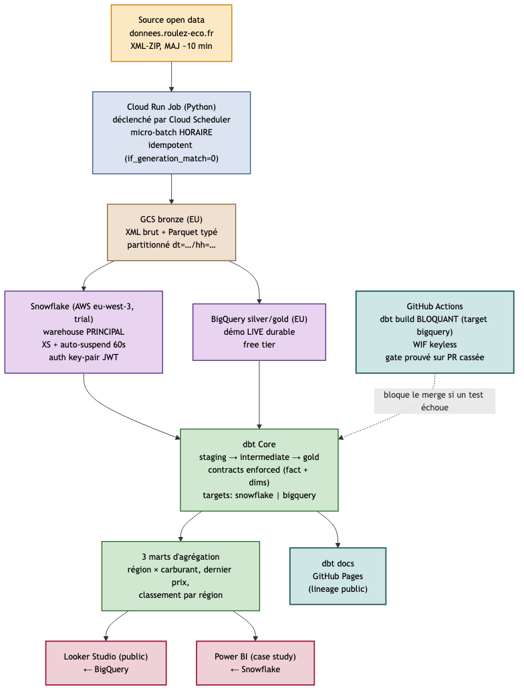

# FuelFlow — pipeline analytique sur les prix des carburants en France

## 1. Le problème métier

Imaginez un comparateur de carburants, un distributeur multi-marques, ou
un opérateur de flotte. Ils reçoivent un flux public mis à jour environ
toutes les 10 minutes, couvrant les **~11 000 stations-service** du
territoire français et **6 carburants** (Gazole, SP95, SP98, E10, E85,
GPLc). Sur ce flux, ils veulent exposer des indicateurs **prix moyen
par région, écart-type, classement des stations les moins chères, carte
interactive** — bref, des KPIs prix/géo **fiables** et **testés**.

Le piège est invisible :
- La source est un fichier **XML-ZIP** dont le format peut changer du
  jour au lendemain (donnée publique, hors notre contrôle).
- Le flux est un **snapshot complet** à chaque tirage : si on l'ingère
  naïvement, on ré-empile les mêmes prix toutes les heures et la table
  fact explose.
- Sans **contrats de schéma** ni **tests automatisés bloquant le merge**,
  un changement source silencieux corrompt le warehouse pendant des
  semaines avant qu'un dashboard cassé ne révèle le problème.

**FuelFlow construit la chaîne complète qui répond à ce problème**, en
montrant les disciplines qu'on attend d'un *Analytics Engineer* :
contrats explicites, idempotence, freshness, CI bloquante, médaillon,
dbt portable entre deux warehouses cloud.

## 2. Architecture



> Source du diagramme : `docs/architecture/fuelflow-architecture.mmd`
> (Mermaid). Régénération : `make diagram`.

## 3. Stack

`Python • uv • GCS • Cloud Run Job • Cloud Scheduler • Snowflake • BigQuery • dbt Core • GitHub Actions • Looker Studio • Power BI`

## 4. Ce qui rend ce projet différent

| Pratique | Comment c'est démontré ici |
|---|---|
| **Data contracts dbt** | Modèles gold avec `contract: enforced: true` ; tout drift de schéma source fait échouer le build. Spec dans [`docs/data-model/star-schema.md`](docs/data-model/star-schema.md). |
| **CI/CD qui bloque le merge** | `dbt build` tourne en GitHub Actions sur chaque PR (target BigQuery, gratuit) ; pas de merge si un test ou un contract échoue. |
| **Ingestion incrémentale + idempotente** | Clé naturelle `(station_id, carburant_id, maj_timestamp)` ; rejouer un run n'introduit jamais de doublon. Détails dans [ADR 0006](docs/adr/0006-grain-du-fait-et-cle-de-dedup.md). |
| **Freshness checks** | `dbt source freshness` avec seuils warn 90 min / error 6 h, déclenche un fail en CI si la source décroche. |
| **ADR pour chaque décision structurante** | Snowflake + BigQuery dual-target, Cloud Run plutôt qu'Airflow, cadence horaire honnête (pas de "temps réel" abusif) — chaque choix est justifié et tracé dans [`docs/adr/`](docs/adr/). |
| **dbt portable Snowflake ↔ BigQuery** | Deux targets dans `profiles.yml`, types abstraits dans les contrats, macros pour les cas exotiques (`md5` qui renvoie BYTES en BQ vs VARCHAR(32) en Snowflake). |

## 5. Structure du repo

```
.
├── README.md                  # vous êtes ici
├── docs/
│   ├── architecture/          # diagramme (.mmd + .png rendu)
│   ├── adr/                   # 7 ADR au format Nygard (français)
│   └── data-model/            # spec star schema + contracts
├── ingestion/                 # L1 — Cloud Run Job Python (XML → Parquet)
├── infra/                     # L2 — création buckets, datasets, base Snowflake
├── transform/                 # L3-L5 — projet dbt (staging → intermediate → gold)
├── orchestration/             # L6 — Cloud Run Job déployé + Cloud Scheduler
├── tests/                     # tests Python (worker d'ingestion)
├── .github/workflows/         # L7 — CI dbt build bloquante
├── pyproject.toml             # uv-managed
├── Makefile                   # setup / lint / test / diagram
└── .pre-commit-config.yaml    # ruff + gitleaks + hooks standards
```

## 6. Liens

- **Dashboard live** (Looker Studio ← BigQuery) : *à publier en L8*
- **dbt docs** (modèles, lineage, tests, contracts) : *à publier en L7*
- **Case study Power BI** (← Snowflake) : *à publier en L8*

## 7. Avancement par lot

| Lot | Sujet | Statut |
|---|---|---|
| **L0** | Initialisation, ADR, design du modèle, diagramme, outillage | ✅ |
| L1 | Ingestion Python (worker XML→Parquet, idempotence, retry, logs structurés) | ⬜ |
| L2 | Infra cloud (buckets GCS, datasets BQ, base Snowflake, secrets) | ⬜ |
| L3 | Projet dbt initial (sources + staging) | ⬜ |
| L4 | Intermediate (nettoyage, jointures, dim référentielle communes INSEE) | ⬜ |
| L5 | Gold (star schema + model contracts + tests) | ⬜ |
| L6 | Orchestration (Cloud Run Job + Cloud Scheduler) | ⬜ |
| L7 | CI/CD GitHub Actions (dbt build bloquant + freshness) | ⬜ |
| L8 | BI (Looker Studio public + Power BI case study) | ⬜ |
| L9 | Polish (README final, screenshots, case study écrit) | ⬜ |

## 8. Démarrer en local

```bash
git clone https://github.com/RaphaelDjaa71/fuelflow.git
cd fuelflow
make setup            # installe uv deps + hooks pre-commit
make lint             # ruff
make diagram          # régénère le PNG d'architecture
```

Variables d'environnement : copier `.env.example` en `.env` et
renseigner (les vrais secrets ne sont **jamais** commités —
hook `gitleaks` actif).

---

*Projet portfolio de **Raphaël DJAA** — Analytics Engineer.
Licence MIT.*
