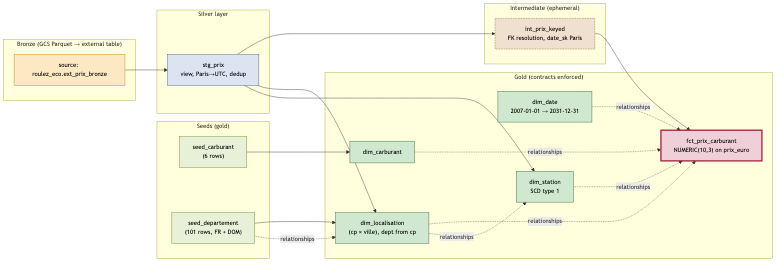

# transform/ — dbt project

**Lot responsable :** L3 (staging) → L4 (intermediate) → L5 (gold + contracts).

**Statut L5 :** ✅ Fait atomique `fct_prix_carburant` + **contracts `enforced: true` portables** sur les 5 modèles gold + 1 test singulier + freshness PASS sur démo + lineage PNG. 63/63 PASS sur les deux warehouses.

**Statut L4 :** ✅ 4 dimensions + 1 intermediate + intégrité référentielle + parité parfaite sur les deux warehouses (72/72 PASS chacun, comptes identiques).

**Statut L3 :** ✅ Staging + tests verts **sur les deux warehouses**, audits Snowflake et BigQuery identiques.

## Structure

```
transform/
├── dbt_project.yml          # layer config: staging=silver(view), intermediate=ephemeral, marts=gold(table)
├── packages.yml             # dbt_utils >=1.3, <2
├── profiles.yml             # GITIGNORED (creds Snowflake + BQ)
├── macros/
│   └── generate_schema_name.sql   # layer-named schemas (no target prefix)
├── seeds/
│   ├── _seeds.yml           # unique/not_null tests on seed keys
│   ├── seed_carburant.csv   # 6 rows (Gazole..SP98)
│   └── seed_departement.csv # 101 rows (96 metropole + 5 DOM)
├── models/
│   ├── staging/
│   │   ├── _sources.yml     # roulez_eco.ext_prix_bronze + freshness
│   │   ├── _models.yml      # stg_prix schema + tests
│   │   └── stg_prix.sql     # typed view + Paris->UTC + dedup
│   ├── intermediate/
│   │   ├── _models.yml      # int_prix_keyed tests (4 relationships)
│   │   └── int_prix_keyed.sql  # ephemeral, resolves 4 FKs + Paris date_sk
│   └── marts/
│       ├── _models.yml      # dim_* schemas + relationships
│       ├── dim_carburant.sql
│       ├── dim_date.sql
│       ├── dim_localisation.sql
│       └── dim_station.sql
└── target/, dbt_packages/, logs/  # all gitignored
```

## Schema routing — macro `generate_schema_name`

By default dbt prefixes the schema with the target's default
(`silver_gold` for a +schema=gold on a profile defaulting to silver).
The override at `macros/generate_schema_name.sql` strips that prefix
and routes by layer instead:

| Layer | BigQuery dataset | Snowflake schema |
|---|---|---|
| staging (`+schema=silver`) | `fuelflow_silver` | `FUELFLOW.SILVER` |
| marts (`+schema=gold`) | `fuelflow_gold` | `FUELFLOW.GOLD` |
| intermediate (ephemeral) | n/a (inlined) | n/a (inlined) |

Verified: `bq ls fuelflow-498320:fuelflow_gold` returns
dim_carburant / dim_date / dim_localisation / dim_station +
seed_carburant / seed_departement; `bq ls fuelflow-498320:fuelflow_silver`
returns stg_prix (VIEW). Identical on Snowflake (`SHOW TABLES IN
FUELFLOW.GOLD` and `SHOW VIEWS IN FUELFLOW.SILVER`).

## Cibles Make

| Cible | Action |
|---|---|
| `make dbt-deps` | Installe les packages dbt (`dbt_utils`). |
| `make dbt-debug T=bigquery` (ou `T=snowflake`) | Valide la connexion. |
| `make dbt-bq` | `dbt build` sur le target **bigquery** (oauth via ADC, free tier, CI). |
| `make dbt-sf` | `dbt build` sur le target **snowflake** (browser MFA prompt — voir § auth). |
| `make dbt-freshness-bq` | `dbt source freshness` (seuils warn 90 min / error 6 h). |
| `make dbt-docs-bq` | `dbt docs generate`. |

## Authentification

### BigQuery (par défaut, CI)
`method: oauth` → utilise les Application Default Credentials du user
(`gcloud auth application-default login`). Pas de clé JSON locale, pas de
secret committé. En L7 la CI utilisera une clé du SA `fuelflow-ci` chargée
depuis GitHub Actions Secrets.

### Snowflake — **key-pair JWT** (dev local + CI L7)
`authenticator: jwt` + `private_key_path` pointant sur
`.secrets/snowflake_rsa_key.p8` (gitigné). Aucun mot de passe dans
`profiles.yml`, aucun prompt MFA à chaque run (la clé privée seule
fait foi).

Set-up déjà fait pour le user `RAPHAELDJAA` :
```bash
# clé générée localement (sans passphrase pour MVP) :
openssl genrsa 2048 | openssl pkcs8 -topk8 -inform PEM \
  -out .secrets/snowflake_rsa_key.p8 -nocrypt
openssl rsa -in .secrets/snowflake_rsa_key.p8 -pubout \
  -out .secrets/snowflake_rsa_key.pub
# clé publique enregistrée côté Snowflake :
#   USE ROLE ACCOUNTADMIN;
#   ALTER USER RAPHAELDJAA SET RSA_PUBLIC_KEY = '<pubkey>';
```
> Le détour par MFA (Snowsight UI / `externalbrowser` / `username_password_mfa`)
> a été écarté en L3 : le trial Snowflake n'a pas SAML IdP configuré
> (externalbrowser KO) et la méthode MFA disponible
> ("none of your current MFA methods are supported for programmatic
> authentication") n'est pas exploitable depuis le connecteur Python.
> Key-pair est la voie propre et c'est ce que la CI utilisera en L7.

## Modèle de staging — `stg_prix`

Matérialisation : `view` (rapide, pas de stockage redondant).

Transformations appliquées :
1. **Typing strict** via `dbt.type_string()`, `type_float()`, `type_numeric()`,
   `type_timestamp()` — portable Snowflake ↔ BigQuery.
2. **Conversion timezone** : la colonne `maj_timestamp` source est en heure
   locale Europe/Paris (naive). Sur BigQuery elle est lue comme TIMESTAMP-UTC
   (faussement) ; on la passe en DATETIME pour gommer ce TZ, puis on
   ré-ancre en Europe/Paris pour récupérer l'instant UTC exact. Sur
   Snowflake, `convert_timezone('Europe/Paris', 'UTC', maj_timestamp)` sur
   un `TIMESTAMP_NTZ` fait la même chose.
3. **Déduplication ligne** sur la clé naturelle
   `(station_id, carburant_id, maj_timestamp_utc)` via `ROW_NUMBER()`
   ordonné par `ingestion_ts` croissant (on garde la première occurrence
   chronologique).
4. **Surrogate key** `prix_sk` via `dbt_utils.generate_surrogate_key`
   (md5 cross-warehouse de la clé naturelle).

## Tests appliqués (13 au total, tous PASS sur BigQuery)

| Type | Cible | Niveau |
|---|---|---|
| `not_null` | prix_sk, station_id, carburant_id, carburant_nom, maj_timestamp_utc, prix_euro, ingestion_ts | error |
| `unique` | prix_sk | error |
| `accepted_values` | carburant_id ∈ {1,2,3,4,5,6} | error |
| `accepted_values` | carburant_nom ∈ {Gazole, SP95, SP98, E10, E85, GPLc} | error |
| `dbt_utils.unique_combination_of_columns` | (station_id, carburant_id, maj_timestamp_utc) | error |
| `dbt_utils.expression_is_true` (BETWEEN 0.5 AND 3.5) | prix_euro | **warn** (donnée source, n'arrête pas la CI) |

## L5 — Fait atomique + contracts enforced + lineage



### `fct_prix_carburant` — table gold, grain (station × carburant × maj)

Matérialisé en table dans `fuelflow_gold` (BQ) / `FUELFLOW.GOLD` (SF), avec
**contract `enforced: true` portable** : la première colonne du SELECT doit
matcher exactement le `data_type` déclaré dans le YAML, ou le build casse.
Les `data_type` sont rendus par Jinja en fonction du `target.type` — c'est
le mécanisme qui rend les contracts vraiment dual-warehouse :

| Colonne | BigQuery | Snowflake |
|---|---|---|
| `prix_sk` | STRING | VARCHAR |
| `station_sk`, `carburant_sk`, `localisation_sk` | STRING | VARCHAR |
| `date_sk` | INT64 (matérialisé en INTEGER) | NUMBER(38,0) |
| `prix_euro` | **NUMERIC** (≡ NUMERIC(38,9)) | **NUMBER(10,3)** |
| `maj_timestamp_utc` | TIMESTAMP (UTC implicite) | TIMESTAMP_NTZ(9) (UTC convention) |
| `ingestion_date` | DATE | DATE |

Vérifié empiriquement : `bq show --schema fuelflow_gold.fct_prix_carburant`
et `DESC TABLE FUELFLOW.GOLD.FCT_PRIX_CARBURANT` montrent bien
**`prix_euro` en type décimal** (`NUMERIC` / `NUMBER(10,3)`), pas float.

### Parité finale BigQuery ↔ Snowflake sur le fait

```
                       BigQuery    Snowflake
COUNT(*)                32 666      32 666
MIN(prix_euro)           0.699       0.699
MAX(prix_euro)           2.89        2.89
COUNT DISTINCT date_sk     108         108
COUNT DISTINCT station_sk 9 608       9 608
```

### Tests (63 au total, tous PASS sur les 2 warehouses)

| Test | Type | Sévérité |
|---|---|---|
| `unique` sur les 5 SK du fait + dims | générique | error |
| `not_null` sur toutes les colonnes contractées | constraint + générique | error |
| `accepted_values` sur `carburant_id`, `carburant_nom`, `month`, `day_of_week`, `month_name_fr` | générique | error |
| 4 × `relationships` `fct → dim` | générique | **error** (intégrité du star schema) |
| `relationships` `dim_station.localisation_sk → dim_localisation` | générique | error |
| `relationships` `dim_localisation.dept_code → seed_departement` | générique | error |
| `dbt_utils.expression_is_true` `prix_euro between 0.5 and 3.5` | générique | **warn** (donnée source, ne casse pas la CI) |
| `assert_no_future_maj` (test singulier, portable) | singular | error |
| `dbt source freshness` sur `ingestion_ts` | source | warn @ 90 min / error @ 6 h |

### Test singulier — piège TZ Snowflake documenté

`tests/assert_no_future_maj.sql` compare `maj_timestamp_utc` à `current_timestamp()`. Sur Snowflake `current_timestamp()` retourne un `TIMESTAMP_LTZ` dans la **session TIMEZONE** ; comparé brut à `TIMESTAMP_NTZ`-UTC, ça produit des faux positifs massifs si la session n'est pas UTC (vu en pratique : 835 "future rows" sur trial Snowflake = America/Los_Angeles).
Fix : normaliser via `cast(convert_timezone('UTC', current_timestamp()) as timestamp_ntz)` côté Snowflake. BigQuery est trivialement UTC.

### Freshness — démo PASS

Après un `make ingest-gcs` frais (nouvelle partition `dt=2026-06-04/hh=00`, 32 851 lignes en bronze), `make dbt-freshness-bq` :
```
1 of 1 PASS freshness of roulez_eco.ext_prix_bronze  PASS  in 0.85s
Done.
```
Note : freshness reste **non bloquante en CI tant que L6 n'a pas livré le scheduler horaire** (cf. `Hors scope` ci-dessous).

### Hors scope L5 — assumé

- **Matérialisation incrémentale du fait** : reportée à **après L6** (scheduler horaire). Sans partitions multiples réelles, l'incrémental n'est pas testable. L'ingestion GCS L1 est déjà incrémentale/idempotente au niveau objet bronze — différenciateur déjà atteint à ce niveau.
- **Marts d'agrégation / KPI** (prix moyen région, classements) → **L8** (BI).

## Audit L4 — parité parfaite Snowflake vs BigQuery

### Counts identiques sur les 2 warehouses

| Objet | Lignes |
|---|---|
| `dim_carburant` | 6 |
| `dim_date` (2024-01-01 → 2030-12-31) | 2 557 |
| `dim_station` (SCD type 1) | 9 608 |
| `dim_localisation` (cp × ville) | 7 116 |
| `seed_departement` | 101 |
| `int_prix_keyed` | 32 666 (= stg_prix) |
| `int_prix_keyed` rows with any null FK | **0** |

### Intégrité référentielle — 5 tests `relationships` au vert sur 2 moteurs

| Test | BQ | SF |
|---|---|---|
| `dim_localisation.dept_code` → `seed_departement.dept_code` | ✅ | ✅ |
| `dim_station.localisation_sk` → `dim_localisation.localisation_sk` | ✅ | ✅ |
| `int_prix_keyed.station_sk` → `dim_station.station_sk` | ✅ | ✅ |
| `int_prix_keyed.carburant_sk` → `dim_carburant.carburant_sk` | ✅ | ✅ |
| `int_prix_keyed.date_sk` → `dim_date.date_sk` | ✅ | ✅ |
| `int_prix_keyed.localisation_sk` → `dim_localisation.localisation_sk` | ✅ | ✅ |

### Preuve `date_sk` Paris (pas UTC)

```
maj_timestamp_utc       utc_date     paris_date_sk
2026-06-02 22:01:...    2026-06-02   20260603
```
22:01 UTC le 2 juin = 00:01 Paris le 3 juin (CEST = UTC+2 en été). Le
`date_sk` reflète bien le **jour métier parisien** (3 juin) et non le jour
UTC (2 juin) — exactement le comportement spécifié.

### `dept_code` dérivé du code postal (pas de géocodage)

Logique portable SQL implémentée dans `dim_localisation.sql` :

| Pattern `cp` | `dept_code` | Exemple |
|---|---|---|
| `cp` commence par `97` ou `98` | `LEFT(cp, 3)` | `97400` → `974` (La Réunion) |
| `cp` commence par `20` et < `20200` | `2A` (Corse-du-Sud) | `20000` → `2A` |
| `cp` commence par `20` et ≥ `20200` | `2B` (Haute-Corse) | `20200` → `2B` |
| autres | `LEFT(cp, 2)` | `34150` → `34` |
| `cp` null ou vide | null | — |

> Limitation connue : la séparation 2A/2B par CP n'est pas exacte au
> bord de plage (un CP peut chevaucher la limite). Préservation du
> dept_code en STRING (jamais en INT) est essentielle pour conserver
> les zéros de tête (`01`..`09`) et les codes alphanumériques (`2A`,
> `2B`).

## Audit empirique L3 — Snowflake et BigQuery, identiques

| Métrique | BigQuery | Snowflake |
|---|---|---|
| `row_count` | 32 666 | 32 666 |
| `distinct prix_sk` | 32 666 | 32 666 |
| `prix_min` / `prix_max` | 0.699 / 2.89 | 0.699 / 2.89 |
| `lat_min` / `lat_max` | 41.391 / 51.065 | 41.391 / 51.065 |
| `lon_min` / `lon_max` | -4.723 / 9.547 | -4.723 / 9.547 |
| `distinct station_id` | 9 608 | 9 608 |
| `maj_min` (UTC) | 2024-05-24 08:17:53 | 2024-05-24 08:17:53 |
| `maj_max` (UTC) | 2026-06-03 21:30:00 | 2026-06-03 21:30:00 |

Le grain et la conversion Paris→UTC sont parfaitement reproductibles
sur les deux moteurs.

### Sortie `dbt build --target snowflake`
```
Found 1 model, 12 data tests, 1 source, 652 macros
Concurrency: 4 threads (target='snowflake')
...
Completed successfully
Done. PASS=13 WARN=0 ERROR=0 SKIP=0 NO-OP=0 TOTAL=13
```

### Sortie `dbt build --target bigquery`
```
Found 1 model, 12 data tests, 1 source, ...
Concurrency: 4 threads (target='bigquery')
...
Completed successfully
Done. PASS=13 WARN=0 ERROR=0 SKIP=0 NO-OP=0 TOTAL=13
```

### Piège timestamp Snowflake — corrigé en L2
La closure Snowflake a révélé que `maj_timestamp` (polars
`Datetime[us]` naïf → Parquet `TIMESTAMP(MICROS)`) était lu par
Snowflake comme un entier de microsecondes mais cast en `TIMESTAMP_NTZ`
en l'interprétant comme **secondes**, produisant des années en
54 millions. Les tests `not_null` / `unique` ne détectaient pas
l'anomalie. Fix appliqué à `infra/snowflake/03_stage_external_table.sql` :
remplacement de `VALUE:maj_timestamp::TIMESTAMP_NTZ` par
`TO_TIMESTAMP_NTZ(VALUE:maj_timestamp::NUMBER, 6)` (scale=6 = micro).
`ingestion_ts` arrive en ISO-8601 (polars `Datetime[us, UTC]`) et n'est
pas affecté.

## Pour rejouer en local

```bash
gcloud auth application-default login          # une fois
cd transform && DBT_PROFILES_DIR=. uv run dbt deps   # ou `make dbt-deps`
make dbt-bq                                    # full build sur BigQuery
make dbt-freshness-bq                          # source freshness
make dbt-sf                                    # Snowflake (browser MFA prompt)
```
